# Knapsack GA and DP Experiment Report

## Summary

A seeded genetic algorithm (GA) was run 30 times on each of 13 benchmark instances. An exact 0/1 dynamic-programming (DP) solver verified the optimum and supplied the comparison curve. The GA's final profit statistics use its best feasible solution found during each run.

## Results

Success rate (SR) is the fraction of runs whose best feasible profit equals the benchmark optimum. GA NFC is the number of chromosome fitness evaluations per run. DP NFC counts table cells computed, n x (capacity + 1). Times are measured locally and are informational; NFC is the primary x-axis because it is less sensitive to machine load.

| Problem | n | Capacity | Optimum | SR | Best | Mean | Worst | Mean GA NFC | Mean GA ms | DP NFC | DP ms |
|:--|--:|--:|--:|--:|--:|--:|--:|--:|--:|--:|--:|
| hard30u300.kp | 30 | 5027 | 10281 | 100.0% (30/30) | 10281 | 10281.00 | 10281 | 1334 | 4.490 | 150840 | 0.696 |
| hard40s1.kp | 40 | 994 | 1788 | 16.7% (5/30) | 1788 | 1784.67 | 1784 | 10019 | 16.543 | 39800 | 0.244 |
| hard40u100.kp | 40 | 1986 | 6773 | 100.0% (30/30) | 6773 | 6773.00 | 6773 | 1083 | 2.544 | 79480 | 0.264 |
| hard40w150.kp | 40 | 2823 | 3580 | 93.3% (28/30) | 3580 | 3579.27 | 3569 | 2418 | 4.785 | 112960 | 0.335 |
| hard50u200.kp | 50 | 4716 | 15126 | 100.0% (30/30) | 15126 | 15126.00 | 15126 | 2920 | 7.519 | 235850 | 0.693 |
| p01.kp | 10 | 165 | 309 | 100.0% (30/30) | 309 | 309.00 | 309 | 256 | 0.137 | 1660 | 0.029 |
| p02.kp | 5 | 26 | 51 | 100.0% (30/30) | 51 | 51.00 | 51 | 118 | 0.063 | 135 | 0.016 |
| p03.kp | 6 | 190 | 150 | 100.0% (30/30) | 150 | 150.00 | 150 | 127 | 0.059 | 1146 | 0.010 |
| p04.kp | 7 | 50 | 107 | 100.0% (30/30) | 107 | 107.00 | 107 | 118 | 0.051 | 357 | 0.005 |
| p05.kp | 8 | 104 | 900 | 66.7% (20/30) | 900 | 899.00 | 888 | 886 | 0.694 | 840 | 0.021 |
| p06.kp | 7 | 170 | 1735 | 100.0% (30/30) | 1735 | 1735.00 | 1735 | 118 | 0.075 | 1197 | 0.012 |
| p07.kp | 15 | 750 | 1458 | 66.7% (20/30) | 1458 | 1456.43 | 1451 | 2393 | 1.831 | 11265 | 0.201 |
| p08.kp | 24 | 6404180 | 13549094 | 73.3% (22/30) | 13549094 | 13540670.97 | 13505878 | 3998 | 4.125 | 153700344 | 378.381 |

## Individual Runs

The aggregate table summarizes the 30 trials per problem. The complete run-by-run data, including every seed, final profit, success flag, NFC, and runtime, is available in [`run_details.csv`](run_details.csv).

## Comparison Graphs

Each graph plots best feasible profit against NFC on a logarithmic x-axis. The DP curve is a staircase: after each item is processed it shows the best profit achievable at full capacity with the items considered so far, and it reaches the optimum only once the last item has been considered. The GA curve is the mean best-so-far profit over all runs at each generation (a run that stops early keeps its final value).

### hard30u300.kp

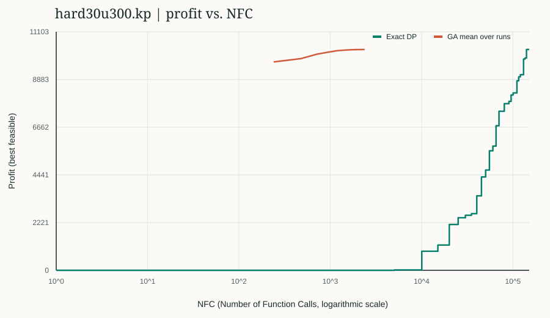

### hard40s1.kp

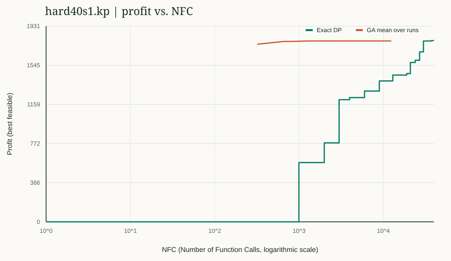

### hard40u100.kp

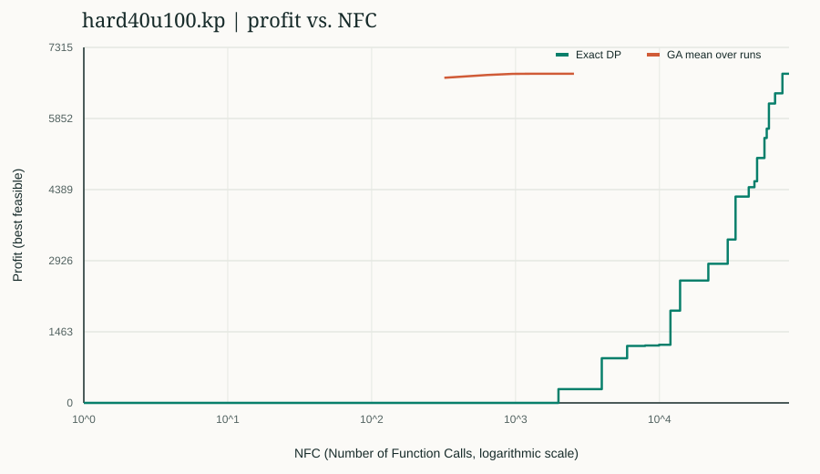

### hard40w150.kp

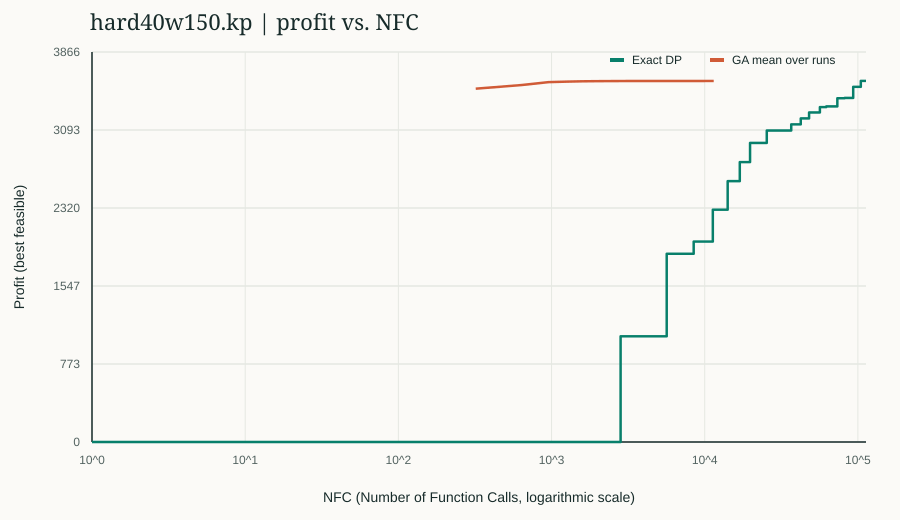

### hard50u200.kp

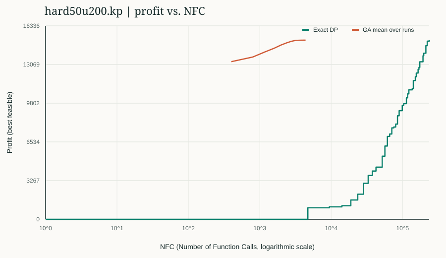

### p01.kp

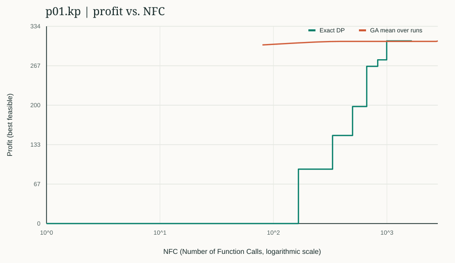

### p02.kp

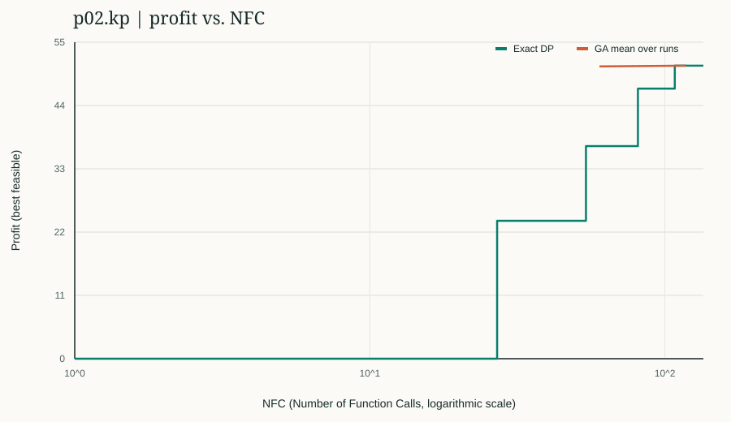

### p03.kp

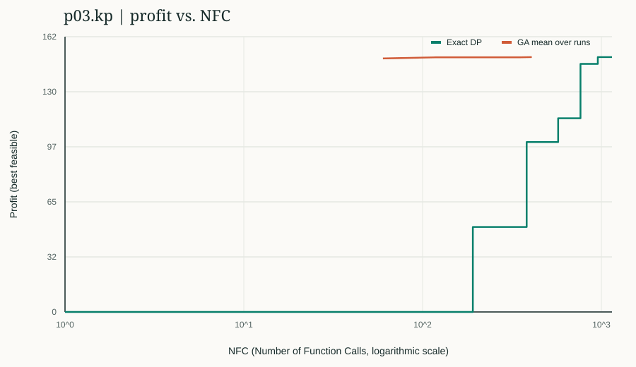

### p04.kp

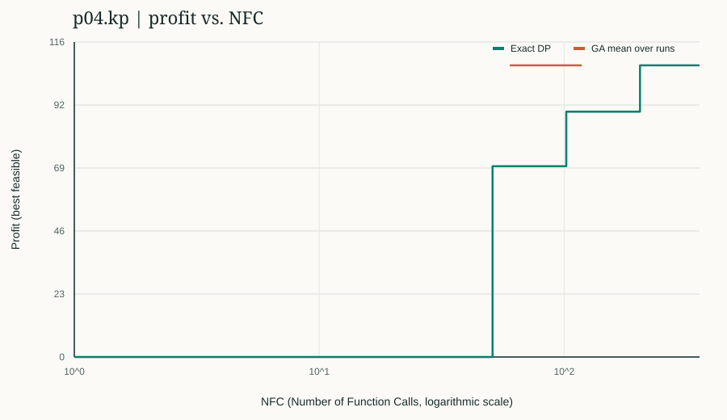

### p05.kp

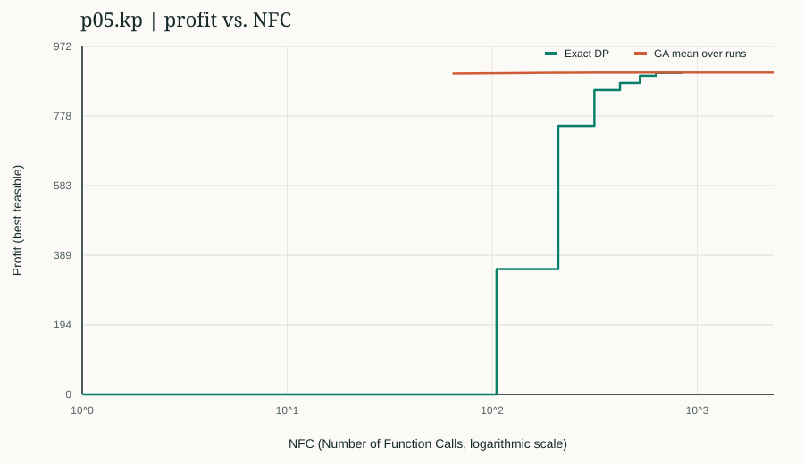

### p06.kp

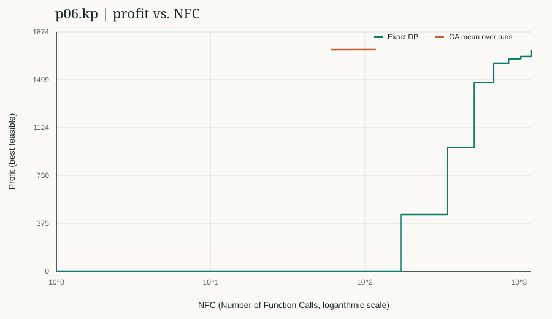

### p07.kp

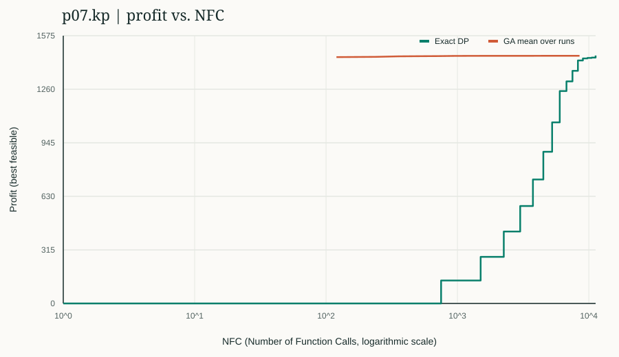

### p08.kp

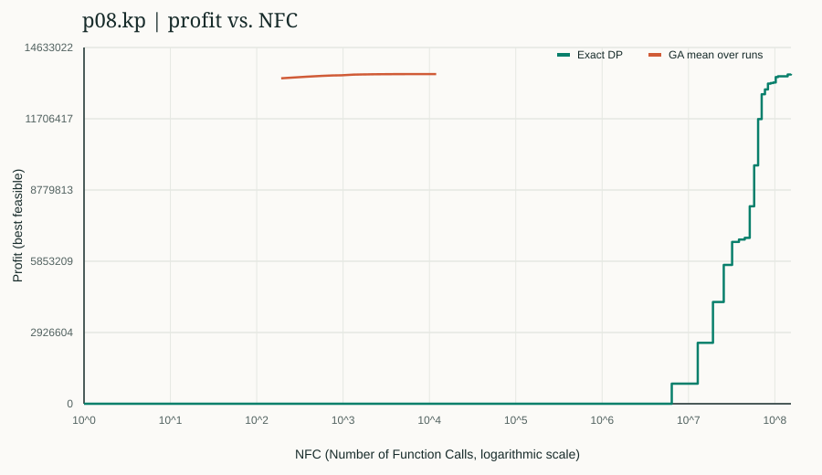

The live dashboard is available at [`live_graph.html`](live_graph.html) while the experiment is running. It refreshes every second and displays the current GA progress against the DP staircase.

## Method

The GA uses binary item-selection chromosomes (bit i = item i packed), tournament selection (size 3), one-point crossover (probability 0.85), bit-flip mutation (probability 0.03 per gene) and 2 elite individuals. Infeasible (overweight) chromosomes are handled with a repair operator: while a chromosome is over capacity, the packed item with the lowest profit/weight ratio is dropped. The population is max(60, 8 x n) chromosomes for at most 150 generations. A run stops early if the known optimum is reached or the best profit has not improved for 35 generations, so NFC differs from run to run. Each run uses its own reproducible seed derived from the benchmark and run index.

The DP baseline is the bottom-up dynamic programming table dp[i][w] (best profit using the first i items with capacity w), filled row by row and traced back to recover the packed items. It is exact, and costs O(n x W) time and memory, which is why it becomes slow when the capacity W is large (p08). The included instances are small benchmark cases; the results should not be generalized to larger or structurally different knapsack instances without additional experiments.

Raw aggregate metrics are in [`empirical_results.csv`](empirical_results.csv), and plotted curve points are in [`trajectories.csv`](trajectories.csv).
